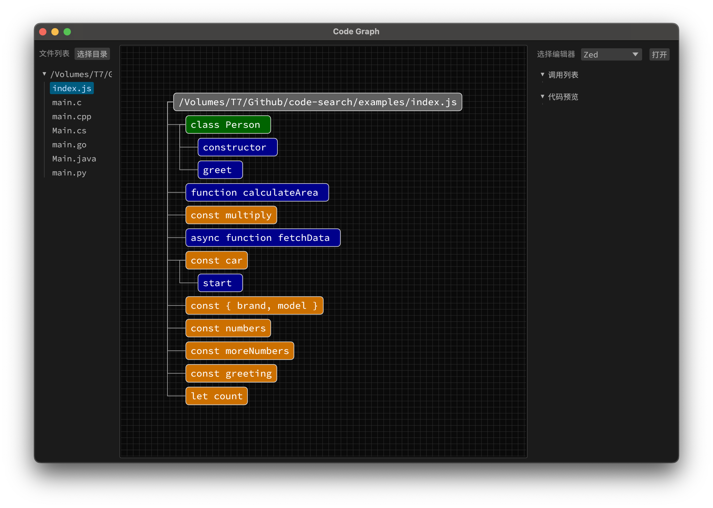

# code-graph
an egui app that can display code graphics and find all references

编程语言支持列表

1. java
2. javascript
3. rust
4. c

#### 界面

| Light | Dark |
|-------|------|
|  |  |

#### 使用第三方编辑器

1. VSCode：`shift+command+p` 搜索 `install code command`
2. Zed：点击菜单`Zed` > `Install CLI`
3. Idea: 点击菜单 `Tools` > `Create Command-line Launcher...`

#### 字体
如果遇到App无法正常开启，请查看系统是否安装以下字体之一：
1. "Source Han Mono SC"
2. "PingFang SC"
3. "Microsoft YaHei"
